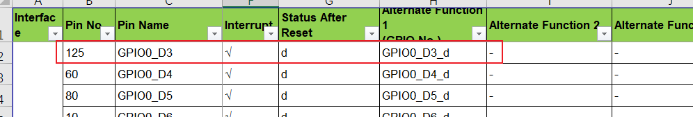
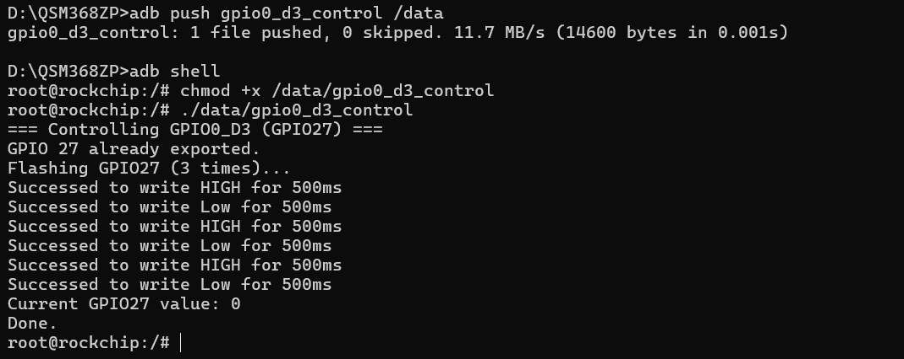

# 移远通信QSM368ZP-WF gpio 操作示例
1. 查看QSM368Z gpio configuration文档，寻找到可作为gpio使用的引脚

2. 以GPIO0_D3为例，RK硬件编号与GPIO编号需要转换一下:
GPIO0_D3: 0x32+3x8+3x1 = gpio27
GPIO2_A1: 2x32+0x8+1x1 = gpio65

3. 此处使用c来控制，具体代码参考gpio0_ds_control.c, 若是需要控制其他gpio可参考改代码更换所用的gpio即可

4. 使用交叉编译工具编译出可执行程序(注意QSM368ZP 为ARM64架构)，后push到/data/路径中，并添加权限

5. 执行效果如下：

