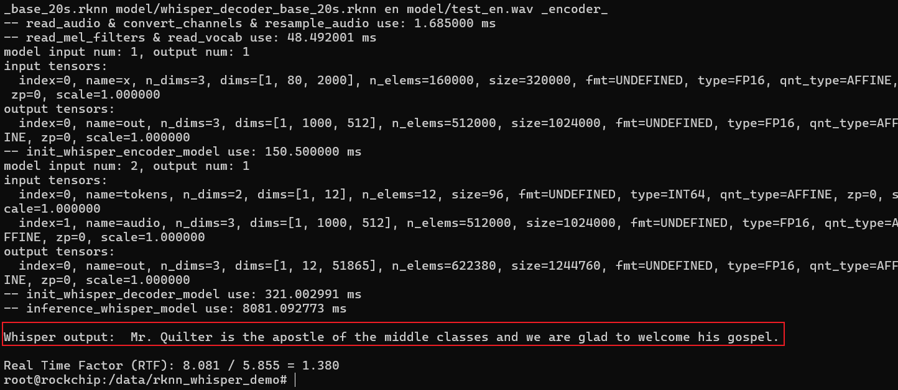
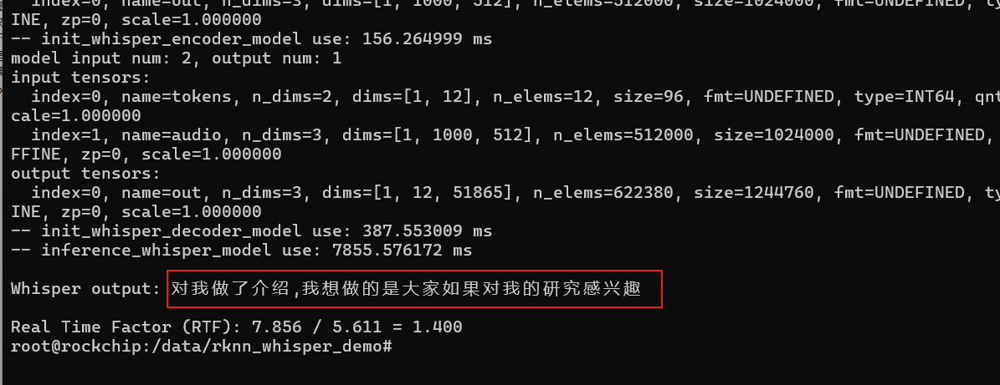

# 移远通信QSM368ZP-WF RKNN whisper 操作示例
#### 1 Push demo files to device

```shell
adb push rknn_whisper_demo/ /data/
```

#### 2 Run demo

```sh
adb shell
cd /data/rknn_whisper_demo

export LD_LIBRARY_PATH=./lib
./rknn_whisper_demo model/whisper_encoder_base_20s.rknn model/whisper_decoder_base_20s.rknn en model/test_en.wav
./rknn_whisper_demo model/whisper_encoder_base_20s.rknn model/whisper_decoder_base_20s.rknn zh model/test_zh.wav

## 2.1 预期结果

This example will print the recognized text, as follows:

# 英文语音运行结果
Whisper output:  Mr. Quilter is the apostle of the middle classes, and we are glad to welcome his gospel.
```


```sh
# 中文语音运行结果
Whisper output: 对我做了介绍,我想说的是大家如果对我的研究感兴趣
```
